# Developer [Carlos Caballero](https://twitter.com/Carlillo)

### Tip # 1

Getting an array of `unique` values is probably easier than you think.

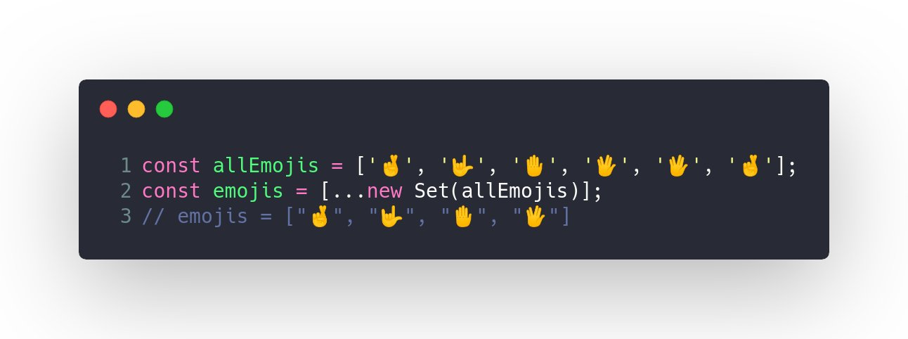

### Tip # 2

Ever need to filter falsy values (0, undefined, null, false, etc.) out of an array?  Just pass Boolean and all those falsy value go away!

### Tip # 3

`Object.fromEntries()` in ES10! Transform a list of key & value pairs into an object

### Tip # 4

A stable sorting algorithm is when two objects with equal keys appear in the same order in the sorted output as they appear in the unsorted input

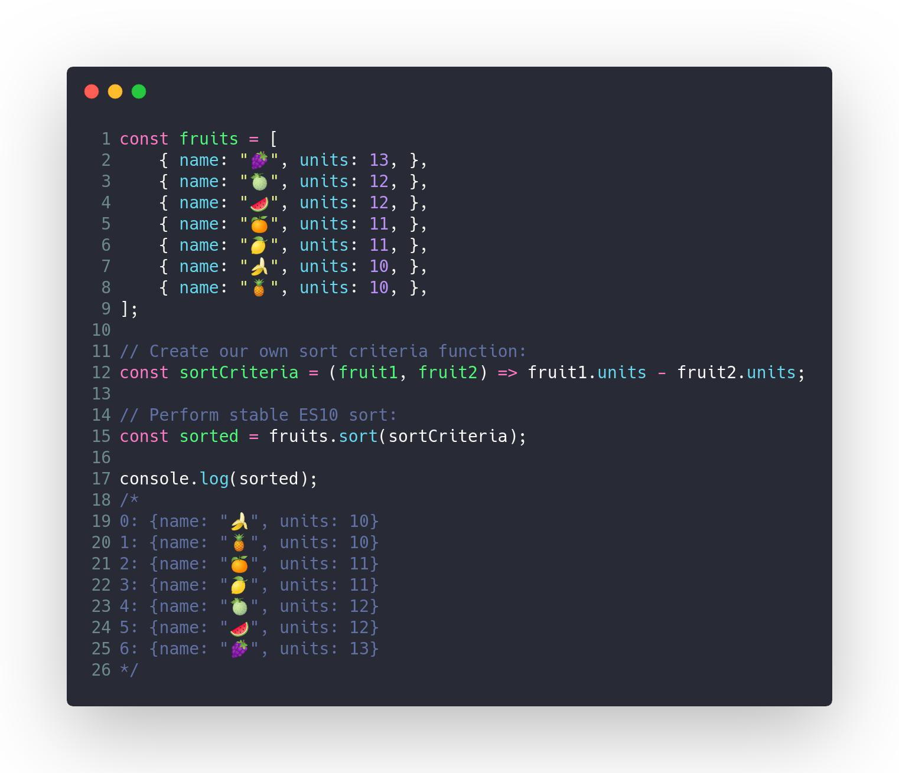

### Tip # 5

Understanding Default Values with JavaScript's `Destructuring` 🧠🧠

> const { eyes = ' 👀' } = object

### Tip # 6

Flatten Arrays in Vanilla JavaScript using `flat()` and `flatMap()`

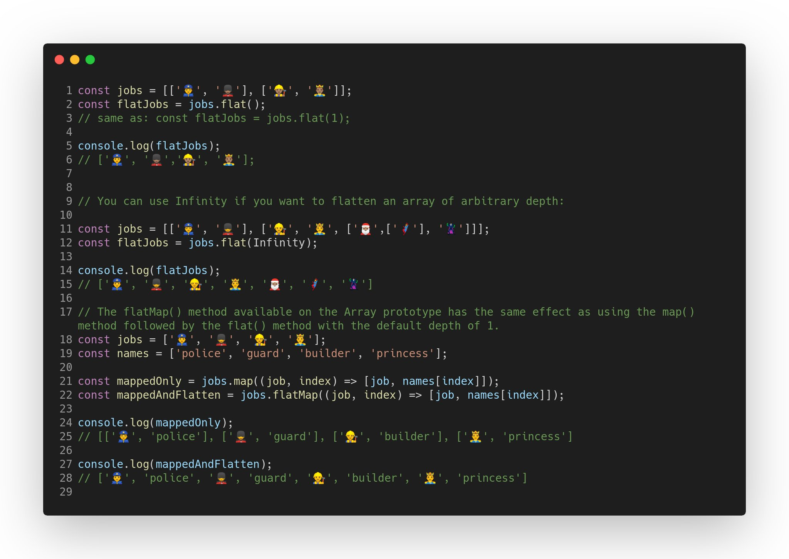

### Tip # 7

`Function.toString()` in ES10! The `toString()` method returns a string representing the source code of the function

### Tip # 8 Dynamic Import

Dynamic `import()` returns a promise for the module namespace object of the requested module. Therefore, imports can now be assigned to a variable using async/await.

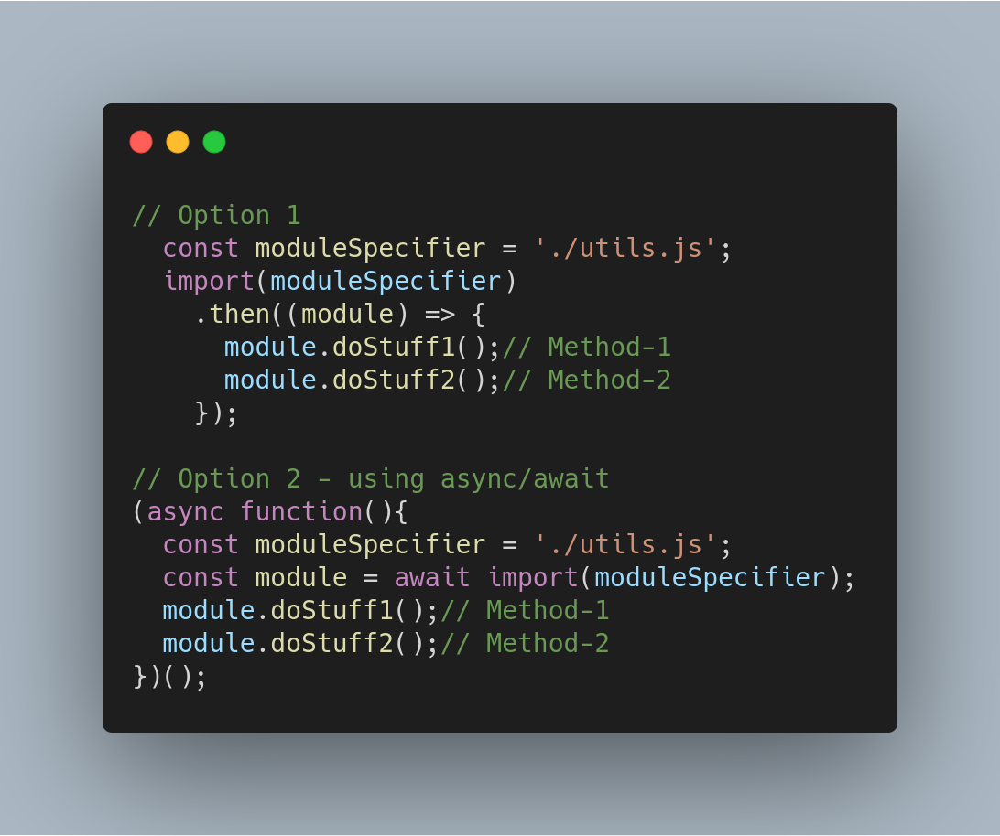

### Tip # 9 Multi-Condition Checking

Multi condition checking! if input is '🔬', '📜', or '👊', call doSomething function then you can use a nice shorthand 👍

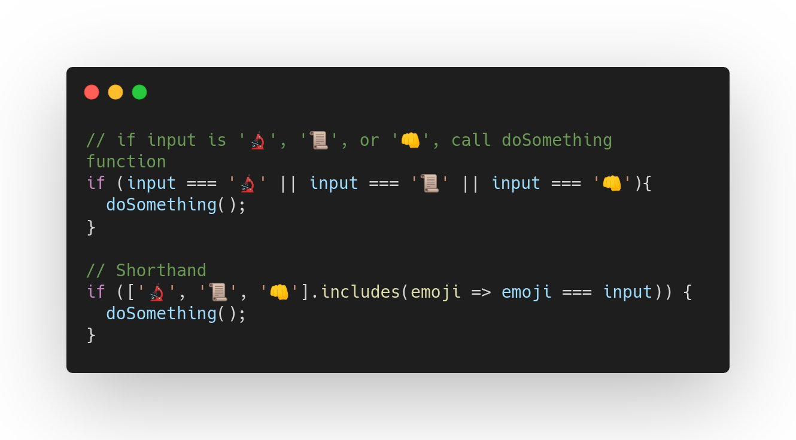

Best Replies

- You could also just write `['🔬', '📜', '👊'].includes(input)` - there's no need for the comparison function. [Lenz Weber](https://twitter.com/phry)

### TIp # 10 Reduce and ReduceRight

The `reduceRight` method applies a function against an accumulator and each value of the array (from right-to-left) to reduce it to a single value.

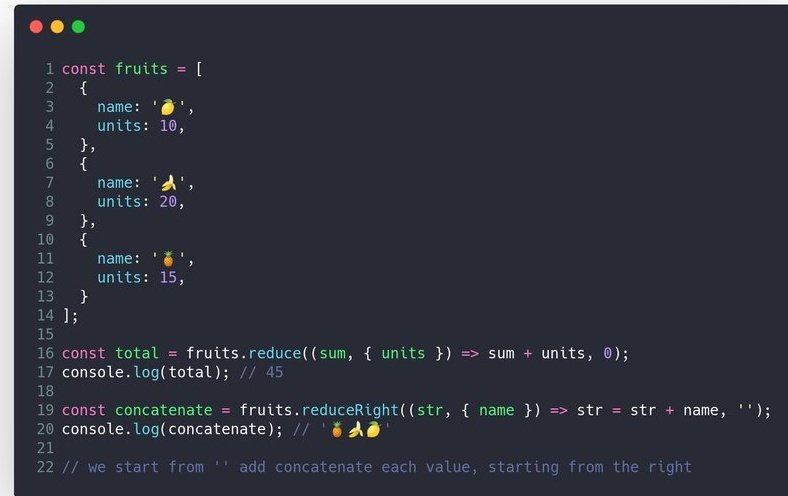

### Tip # 11 Async Iteration in for...of

Asynchronous Iteration in ES2018! Asynchronous iterators  returns a promise for a { value, done } pair. we can now use the await keyword with for … of loops.

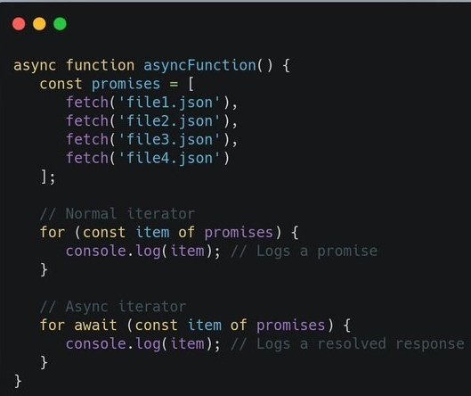

### Tip # 12 BigInt

BigInt is the 7th primitive type in ES10! BigInt is an arbitrary-precision integer. What this means is that variables can now represent 2⁵³ numbers.

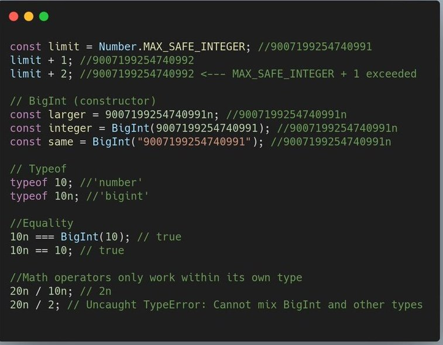

### Tip # 13 gblobalThis

globalThis in ES10! The global this was not standardized before ES10. However, you would standardize it across multiple platforms on your own but now there is globalThis Object.

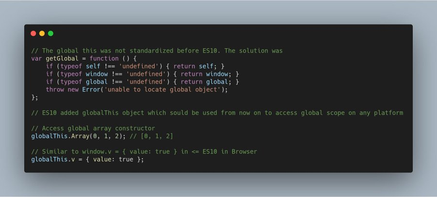

### Tip # 14 Understanding Callbacks

The findOne method simulates the search for a data in a data structure that takes 2 seconds to resolve the result

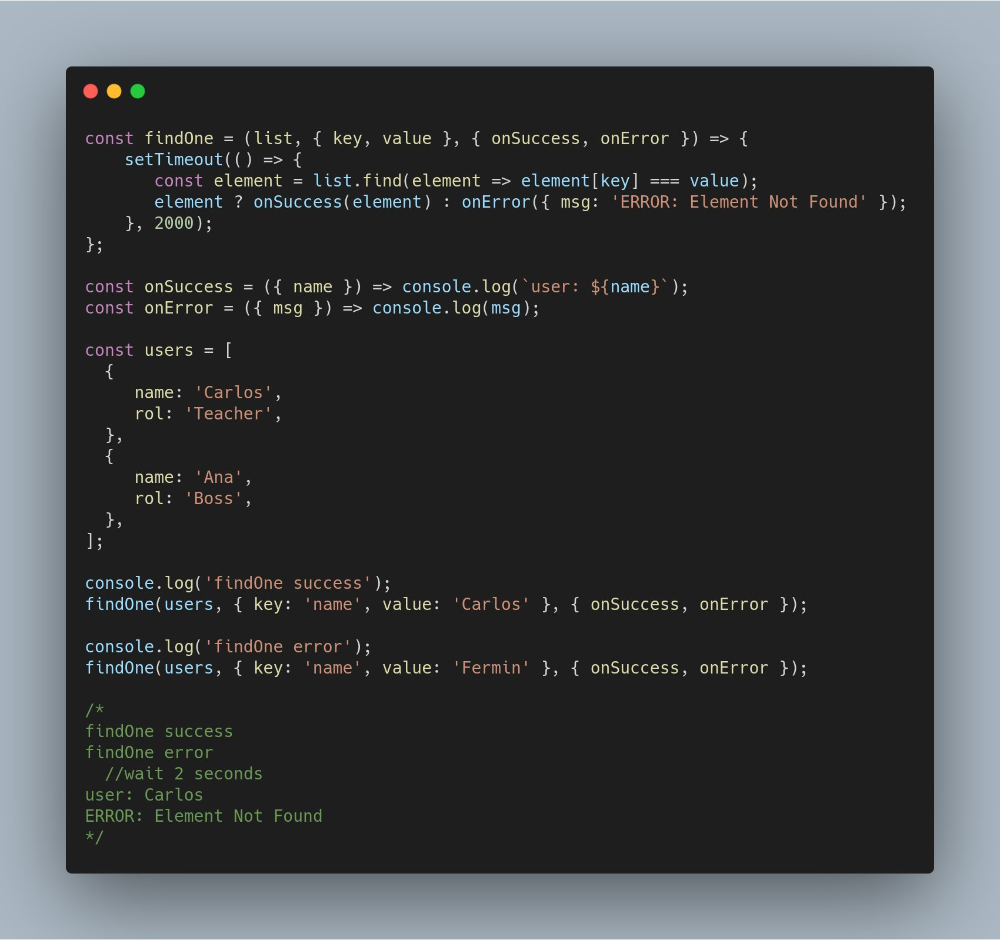

### Tip # 15 Promise.all (ES2015) vs Promise.allSettled (ES2020)

Promise.all - If any promises is rejected then  immediately rejects with that error
Promise.allSettled - Wait for all passed promises to settle

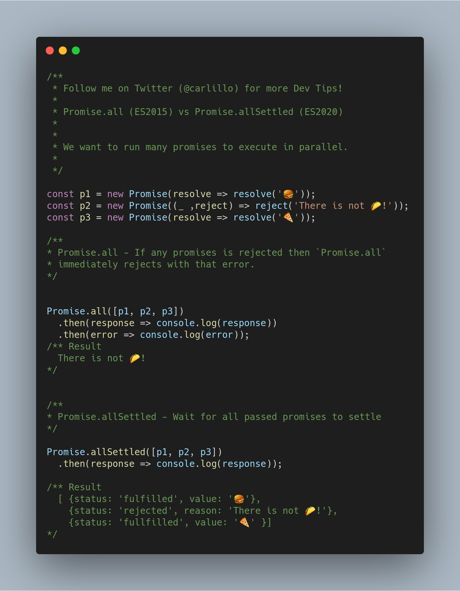

- [Twelve ES10 Features in Twelve Simple Examples](https://medium.com/better-programming/twelve-es10-features-in-twelve-simple-examples-6e8cc109f3d3)

### Tip # 16 Optional Chaining Operator I - ES2020

The Optional Chaining Operator allows handle many of those cases without repeating themselves and/or assigning intermediate results in temporary variables.

### Tip # 17 Optional Chaining Operator II - ES2020

The Optional Chaining Operator allows handle many of those cases without repeating themselves and/or assigning intermediate results in temporary variables.

[:arrow_up: Back to top](#developer-carlos-caballero)
